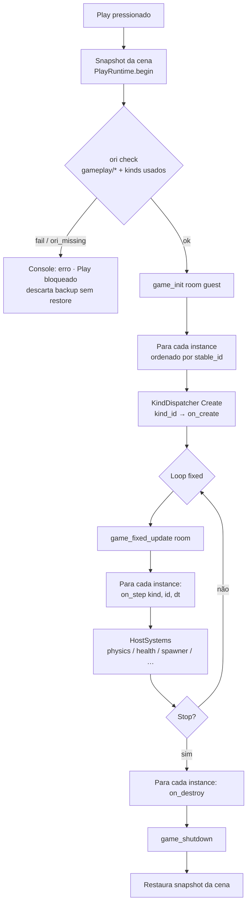

# Object Types (estilo GameMaker) — como controlar um objeto

## Uma frase

> Você **cria um Object Type (kind)**. Depois **coloca instances** na cena
> escolhendo esse kind. O código do **tipo** roda nos eventos; a instance só
> tem posição e overrides.

## Analogia

| GameMaker | Aqui |
|-----------|------|
| Object `obj_player` | `kinds/player.kind.ron` (+ `player.orl`) |
| Instance no Room | Entity com `kind: "player"` |
| Event Step | `on_step(self_id, dt)` do kind |
| Object Variables | `vars` no kind / overrides na instance |
| Alarm 0–3 | `alarm_set` / `alarm_get` + evento `on_alarm` |
| Parent object | `parent_kind` (defaults; cadeia de eventos no runtime) |

**Não existe:** arrastar um script em cada caixa da Hierarchy (script por
instance). Ver [ADR-0013](../adr/0013-object-types-gamemaker.md).

## Passos

### 1. Criar o Object Type

#### New Object Type (editor)

No editor, **não é preciso** editar RON à mão:

1. Hierarchy → botão **+Type**, ou Project → **New Object Type** / toolbar **Type**.
2. Escolha o **template**: Player, Enemy, Spawner, Solid, Empty.
3. Informe o **id** (slug ascii: letras, dígitos, `_`; sem caminho, sem ponto).
4. **Create** grava:
   - `kinds/<id>.kind.ron` (dados do tipo)
   - `kinds/<id>.orl` (stub com `on_create` / `on_step` / `on_destroy` vazios)
5. O catálogo recarrega e o Place Object seleciona o id novo.

**Fail closed:** id inválido ou já existente → erro no wizard; nada é sobrescrito.

Templates reutilizam os builtins (`player`, `enemy_grunt`, `spawner`, `solid`)
mais **Empty** (sem tags/modules). O `id` digitado substitui o do template e
`script` passa a `kinds/<id>.orl`.

#### À mão (opcional)

Arquivo `kinds/player.kind.ron`:

```ron
(
  format_version: 1,
  id: "player",
  name: "Player",
  parent_kind: None,
  default_tags: ["player"],
  default_behaviours: ["health"],
  default_mesh_path: None,
  engine_modules: ["character_controller"],
  events: [Create, Step, Destroy],
  vars: [
    (name: "move_speed", value: Float(5.0)),
  ],
  events: [Create, Step, Destroy, Collision],
  events: [Create, Step, Destroy], // player demo also lists Alarm
  vars: [],
  script: Some("kinds/player.orl"),
)
```

### 2. Colocar na cena (Place Object Type)

Hierarchy → escolher o Object Type no combo → **Place**.  
Isso cria uma instance com `kind: "player"` e defaults do kind.

### 2b. Variáveis na instance (Inspector)

No Inspector da entity:

1. Foldout **Variables** lista as vars efetivas (default do kind ∪ overrides).
2. Edite float/int/bool/string — o valor vira **override da instance**.
3. **Reset** (por var) ou **Reset all to kind default** remove o override;
   no próximo Play volta o default do kind.

Os overrides gravam no `scenes/*.scene.ron` no campo `var_overrides`
(mapa nome → valor; omitido = vazio). Exemplo:

```ron
(
  id: "player_01",
  name: "Player",
  kind: "player",
  // …
  var_overrides: {
    "move_speed": Float(12.0),
    "label": String("fast"),
  },
)
```

**Ordem no Play (seed):** defaults do kind (com parent flatten) → depois
cada chave de `var_overrides` sobrescreve. A API `var_get_*` / `var_set_*`
lê o store de sessão já mesclado.

**Troca de Object Type / Apply Object Type defaults:** limpa `var_overrides` da
instance (evita override órfão de outro kind, ex.: `move_speed` em enemy).

### 3. O que roda no Play

```text
Play
  → ori check (gameplay/* + kinds usados na cena)
  → on_create(cada instance)
  → cada fixed step:
      on_step(cada instance)
      física (Rapier) + systems de engine
      pares AABB únicos → on_collision(self, other) em ambos os lados
       on_step(cada instance)
       systems de engine (health, física, …)
       tick alarms → on_alarm(index) se disparou
Stop
  → on_destroy(cada instance)
```

Até a toolchain Ori exportar dylib (EB-6), o **Step do player** roda no shim
Rust (`KindBehaviour` para `player`); o `.orl` do kind passa em `ori check`.
Backend de runtime: env **`ORI_KIND_RUNTIME`** (`shim` default | `ori` reservado
para EB-6) — ver [contrato Ori](#contrato-ori-kindsidorl).

#### Multi-kind `ori check`

| Entrada | Obrigatório? |
|---------|----------------|
| `gameplay/*.orl` | Sim — ausência ou erro bloqueia Play |
| `kinds/<id>.orl` (campo `script` ou default) | Só se o arquivo **existir**; kind data-only (sem `.orl`) gera **warning**, não bloqueia |

Console (Play ou **Check Ori**):

```text
Object Types N, scripts checked M
```

- **Play:** N = kinds distintos **na cena**.
- **Check Ori:** N inclui também o catálogo do projeto.
- Override do CLI: env **`ORI_BIN`** (ver [host-api-e2e.md](host-api-e2e.md)).

### 3b. Alarms (0–3 por instance)

Como no GameMaker, cada instance tem **4 timers** (`alarm_0`…`alarm_3`).

| API | Efeito |
|-----|--------|
| `alarm_set(self, index, seconds)` | Arma o slot (`index` **0..=3** inclusive). `seconds < 0` cancela. NaN/inf → falha. |
| `alarm_get(self, index)` | Segundos restantes, ou “vazio” se inativo. |

A cada fixed step o host decrementa os timers ativos. Quando chega a ≤ 0,
dispara **uma vez** o evento `on_alarm(self, index)` e limpa o slot
(pode rearmar dentro do handler). `seconds = 0.0` dispara no **próximo**
fixed tick (após um decremento).

**Demo embutido:** o kind `player` usa o slot **0** como cooldown de ataque
melee (0,35 s após um hit). Enquanto o alarm está ativo, não ataca de novo;
ao disparar, o HUD mostra `player attack ready`.

```text
// ideia no kind (shim Rust / futuro .orl)
// Step: se alarm_get(self, 0) vazio e atacou → alarm_set(self, 0, 0.35)
// on_alarm(self, 0): cooldown acabou
```

### 4. Engine modules vs código do kind

| Engine module | O que é |
|---------------|---------|
| `character_controller` / `player_controller` | input → `player_move` (host/guest) |
| `health` | HP no combat system |
| `spawner` | spawna prefab da tag `prefab:…` |

São “components de engine” (`behaviours[]` no RON da cena), **não** scripts
livres. Preferir defaults do kind; lista raw na entity é caminho avançado
(legado EB-1…4 — ver [entity-behaviours-e-attach.md](../planning/entity-behaviours-e-attach.md)).

No Inspector, o caminho feliz é **Object Type** + **Variables** +
**Who controls this**. A lista bruta `behaviours[]` da instance fica no foldout
fechado por padrão **Engine modules (advanced)**, com aviso para preferir os
defaults do kind (`Apply Object Type defaults`). O registry de modules **não**
foi removido — só a UX o demove.

| Onde | O que usar |
|------|------------|
| Hierarchy **Place** / **+Type** | Criar/colocar Object Types |
| Inspector **Object Type** | Trocar kind; ver eventos/script/modules do tipo |
| Inspector **Variables** | Overrides de Object Variables |
| Inspector **Engine modules (advanced)** | Override pontual de `behaviours[]` |
| Status bar (seleção com kind no catálogo) | Hint `Object Type: Nome (id)` |

### 5. Cópia do editor (terminologia)

- Hierarchy: seção **INSTANCES**; botão **Place** (Object Type); **+Type** (wizard).
- Project: **New Object Type** / toolbar **Type**; contagem de Object Types em Quick paths.
- Prefira “Object Type” / “instance” no produto; “behaviour” só como id de engine module.
### 5. Parent kind (herança de Object Type)

Como o **Parent Object** do GameMaker: um kind pode apontar
`parent_kind: Some("enemy_base")`.

**O que herda (no load do catálogo):**

- tags, behaviours/engine modules, mesh default
- object variables (filho sobrescreve o mesmo `name`)
- `events[]` se o filho deixar a lista vazia

**O que corre no Play (eventos):**

```text
instance kind = enemy_grunt  (parent = enemy_base)

Create / Step / Destroy:
  1. handler de enemy_grunt   ← filho primeiro
  2. handler de enemy_base    ← depois o pai
```

Só entram na cadeia kinds que **declaram** aquele evento em `events[]`.
Kind só-dados (sem shim Rust / sem `.orl` no futuro) é ignorado no dispatch
mas ainda contribui com defaults.

**Limites:** cadeia com ciclo ou profundidade > 8 → warning no catálogo;
defaults desse kind não são achatados (soft-fail).

Exemplo no projeto:

| Arquivo | Papel |
|---------|--------|
| `kinds/enemy_base.kind.ron` | tags `enemy`, vars `hp`/`speed`, events Create/Step/Destroy/Collision |
| `kinds/enemy_grunt.kind.ron` | `parent_kind: Some("enemy_base")`, override `hp`, tag `wave` |

### 6. Collision (estilo GameMaker)

Declare `Collision` em `events[]` do kind. Cada fixed step, **depois** da
física, o host:

1. Monta um AABB **só** para instances cujo kind declara `Collision` (e não
   estão mortas no combat). Half-extents: `|scale| * 0.5` (mín. 0,25 m);
   player usa a posição do character controller quando disponível.
2. Enfileira pares **únicos** e não ordenados (`a < b`) que se sobrepõem.
3. Dispara `on_collision(self, other)` em **cada lado** se o kind declarar
   Collision (cadeia filho→pai como nos outros eventos).

**Demo:** `enemy_grunt` vs `player` aplica **4 de dano a cada 0,5 s** (cooldown
no handler — o evento GM dispara todo step em overlap, mas o *payload* de dano
deve ser rate-limited). `solid` / `player` só logam o par. HostSystems **não**
empilha dano de proximidade quando o kind do inimigo declara Collision.

#### Limitações (v1)

| Item | Situação |
|------|----------|
| Pixel masks do GameMaker | **Não** — só AABB |
| Contatos Rapier por mesh | **Não** no pipeline de evento (física continua em brushes/props) |
| Evento “Collision with object X” filtrado | **Não** — um evento genérico; filtre `other` no handler |
| Custo | Broad phase O(n²) só entre kinds com Collision |
| Dano contínuo | Handler deve rate-limitar (demo usa cooldown 0,5 s) |

Para desligar: remova `Collision` de `events[]` (kind só-dados ou sem handler
é ignorado no dispatch).

## Fluxo mental
---

## Contrato Ori (`kinds/<id>.orl`)

Este é o contrato **normativo** do script do Object Type. O host Rust
(`KindBehaviour` / `KindDispatcher`) espelha as mesmas assinaturas até EB-6.

### Layout e namespace

| Item | Regra |
|------|--------|
| Path default | `kinds/<id>.orl` (ou campo `script` no `.kind.ron`) |
| Namespace | **`game.kinds.<id>`** — `<id>` = id do kind (slug, igual ao arquivo) |
| Um kind por arquivo | Não misturar handlers de kinds diferentes no mesmo `.orl` |
| Room-level | Hooks `game_init` / `game_fixed_update` / … ficam em `gameplay/*.orl`, **não** no kind |

Exemplo (id `player`):

```ori
namespace game.kinds.player

-- Object Type events (GameMaker-like). Runtime uses host KindBehaviour shim
-- until Ori can export a dylib (EB-6). This file is checked with `ori check`.

func on_create(self_id: u64)
    const _s: u64 = self_id
end

func on_step(self_id: u64, dt: float)
    const _s: u64 = self_id
    const _dt: float = dt
end

func on_destroy(self_id: u64)
    const _s: u64 = self_id
end
```

### Eventos v1 (assinaturas exatas)

| Evento | Função Ori | Parâmetros | Quando o host chama |
|--------|------------|------------|---------------------|
| Create | `on_create` | `self_id: u64` | Instance entra no Play / spawn |
| Step | `on_step` | `self_id: u64`, `dt: float` | Cada fixed step (dt em segundos) |
| Destroy | `on_destroy` | `self_id: u64` | Instance sai do Play / despawn |

- **`self_id`:** id estável da instance no host (`u64`). Não é handle opaco
  de engine — use-o com a API `game.*` / `GameHostApi` (ex.: `health_ensure`,
  `transform_get_position`).
- **`dt`:** delta do fixed step em **segundos** (`float` Ori ≈ `f32` no host).
- Funções **ausentes** no `.orl` (ou no shim): no-op para aquele evento.
- Retorno: **sem valor** (efeito colateral via host API apenas).

### Eventos planejados (não exigidos no contrato v1 deste guia)

Quando o pipeline de Collision/Alarm existir no host, o stub esperado será:

| Evento | Função Ori (planejada) | Notas |
|--------|------------------------|-------|
| Collision | `on_collision(self_id: u64, other_id: u64)` | Após física; par único por step |
| Alarm | `on_alarm(self_id: u64, index: i32)` | Slots 0–3; ver docs/13 quando mergeado |

Não implemente esses nomes no `.orl` esperando chamada hoje — só Create/Step/Destroy
são despachados no MVP.

### API disponível no script

O kind **não** recebe o mundo por parâmetro. Interage só via superfície
ND-first documentada em [13-api-game-minima.md](../13-api-game-minima.md) e
[host-api-e2e.md](host-api-e2e.md) (input, transform, combat, spawn, UI, …).

Hoje o shim Rust chama `GameHostApi` diretamente. No EB-6, o dylib Ori usará
os mesmos bindings `ori_engine_*` / wrappers `game.*`.

### Runtime mode (`ORI_KIND_RUNTIME`)

Valores comparados em **minúsculas** (`shim`, `ori`). Qualquer outro valor
(incluindo `ORI` maiúsculo) → `shim`.

| Valor | Significado |
|-------|-------------|
| `shim` (default / omitido / outro) | `KindDispatcher` usa handlers Rust builtin (`PlayerKind`, …) |
| `ori` | Preferência de modo; load real via `ORI_GAMEPLAY_DYLIB` + `load_kind_dylib` |

```bash
# default — shim Rust
cargo run -p ori-engine -- run --project examples/empty_project

# EB-6 sample (host load real)
cargo build -p ori-engine-gameplay-sample
export ORI_GAMEPLAY_DYLIB=$PWD/target/debug/libori_gameplay_sample.so
cargo run -p ori-engine -- run --project examples/empty_project
```

Detalhe ABI: [eb6-dylib-abi.md](eb6-dylib-abi.md).

### Símbolos exportados (EB-6 host)

C ABI estável no host (`ori_gameplay_abi_version`, `ori_game_*`, `ori_kind_*`).
Quando o compiler Ori exportar dylib, o guest deve exportar os mesmos símbolos
(em vez de mangling Ori interno):

```text
ori_kind_create / ori_kind_step / ori_kind_destroy
ori_kind_collision / ori_kind_alarm
```

Até lá, só o **check** de tipo/sintaxe do `.orl` é garantido no Play.

---

## Ciclo de vida (completo)

### Diagrama (Play session)



> **Host:** o backup (`scene_backup`) é feito em `PlayRuntime::begin` **antes** do
> `ori check`. Se o check falha, o Play encerra e descarta o backup sem
> “restore” de cena editada (não houve mutação de play).

### Fluxo mental (autor de jogo)

```text
kinds/player.vars  ──defaults──►  instance.var_overrides  ──seed──►  Play store
      │                                    │
      └── events (Create/Step) ──var_get_*─┘──API──► física / spawn / damage
kinds/enemy_base  ──defaults + events──┐
kinds/enemy_grunt ──override + events──┼──► instance na cena
                                        │
      events: child → parent ──API──► física / spawn / damage
      Collision: AABB pairs → on_collision both sides
```

### Quem controla o quê

| Camada | Responsável |
|--------|-------------|
| `kinds/<id>.kind.ron` | Dados do tipo: tags, modules, vars, script path |
| `kinds/<id>.orl` | Lógica do **tipo** (contrato acima) |
| Instance na cena | `kind`, transform, overrides; **sem** path `.orl` |
| `gameplay/*.orl` | Hooks de room / global |
| Host systems | Engine modules (`behaviours[]` / defaults do kind) |
| `KindDispatcher` shim | Execução real dos eventos até EB-6 |

---

## Troubleshooting

| Sintoma | Causa provável | O que fazer |
|---------|----------------|-------------|
| Play bloqueado; Console `ori_missing` | CLI `ori` não no PATH | Instalar ori-lang ou `export ORI_BIN=/path/to/ori` |
| Play bloqueado; `fail` em `kinds/player.orl` | Erro de sintaxe/tipo no kind script | Corrigir `.orl`; **Check Ori** e ler o diagnostic |
| Play bloqueado; falta `gameplay/*.orl` | Projeto sem hooks de room | Criar `gameplay/hello_walk.orl` (template do empty_project) |
| Warning `kind 'X' script missing (data-only OK)` | Kind sem `.orl` | OK se o kind for só dados/modules; senão crie `kinds/X.orl` |
| Instance na cena mas sem movimento | Kind sem shim / sem module `player_controller` | Use kind `player` (builtin) + module; confira “Who controls this” |
| Mudei o `.orl` e o comportamento não mudou | EB-6 ainda não carrega dylib | Runtime = **shim Rust**; o `.orl` só passa em `ori check` até dylib |
| `ORI_KIND_RUNTIME=ori` sem efeito | Load dylib não implementado | Esperado; permanece shim até `load_kind_dylib` real (EB-6) |
| `Object Types N, scripts checked M` com M &lt; N | Alguns kinds data-only | Normal; só arquivos existentes são checked |
| Script na Hierarchy / path `.orl` na entity | Modelo errado (Godot/Unity script) | **Proibido** no v1 — use Object Type + events do kind |
| Prefab vs kind confuso | Prefab = árvore de instances com kinds | Prefab **compõe**; cada nó ainda tem `kind` |

### Checklist rápido “meu objeto não reage”

1. Entity tem `kind` apontando para um id do catálogo?  
2. Esse kind tem entry em `kinds/*.kind.ron`?  
3. Se há lógica custom: existe `kinds/<id>.orl` com namespace `game.kinds.<id>` e
   `on_create` / `on_step` / `on_destroy` com as assinaturas da tabela?  
4. `ori check` nesse arquivo passa (Check Ori)?  
5. Lembra que **execução** ainda é shim para builtins (`player`, `enemy_grunt`,
   `spawner`, `solid`, `player_start`) — kinds só-dados não têm handler de Step.

---

## Ver também

- ADR-0013
- `docs/13-api-game-minima.md` (`var_*`)
- ADR-0013 (ordem child→parent documentada)
- `docs/13-api-game-minima.md`
- `docs/guides/host-api-e2e.md`
- `examples/empty_project/README.md`
- [ADR-0013 — Object Types GameMaker](../adr/0013-object-types-gamemaker.md)
- [04 — Scripting Ori](../04-scripting-ori.md) (room hooks + Object Types)
- [13 — API game mínima](../13-api-game-minima.md)
- [guides/host-api-e2e.md](host-api-e2e.md) (Play, `ORI_BIN`, multi-kind check)
- [planning/entity-behaviours-e-attach.md](../planning/entity-behaviours-e-attach.md)
  (legado engine modules / EB-6 dylib)
- [planning/execute-plan-object-types-gamemaker.md](../planning/execute-plan-object-types-gamemaker.md)
